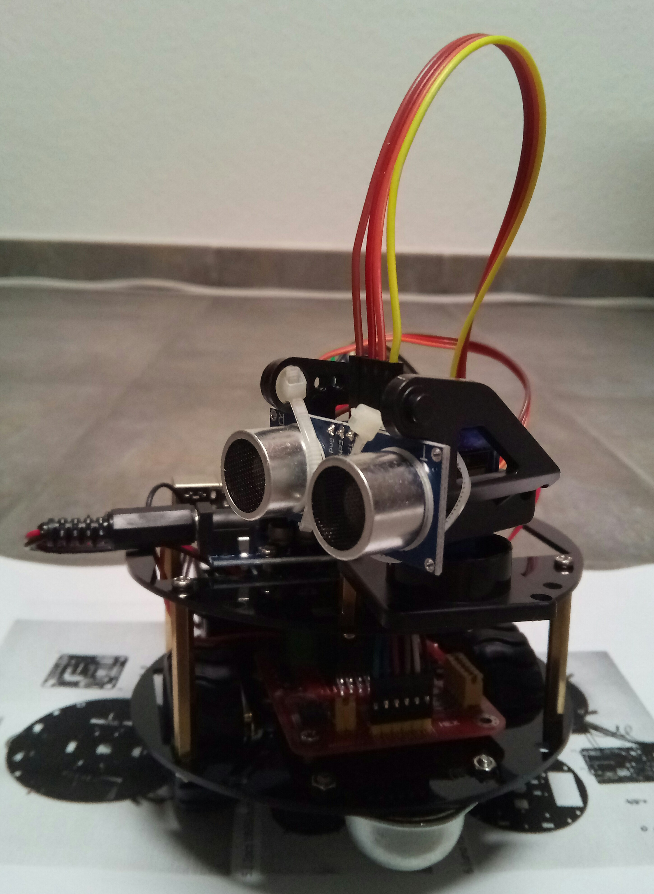

# My robot

This is a small robot I got as a kit from China. It's a nice little kit.

### The main parts are:

* 1 x Arduino Uno
* 1 x Sensor Shield V5 (There are no other shield versions, only V5. Don't ask me why.)
* 1 x L298n motor driver board 
* 2 x DC motors
* 2 x SG90 servo
* 1 x ultrasonic sensor

### Additional parts:

* 1 x rain sensor
* 2 x IR/line-follower sensors

I haven't added the additional sensors yet.
The classes for the sensors and the DC motors are [in a separate project](https://github.com/texjoachim/my_arduino_libraries).

